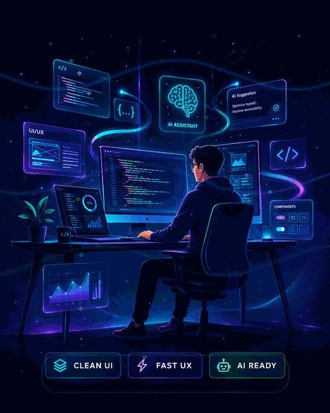

<!--
  GitHub Profile README for MRezaGhaderi1379
  Repository name must be exactly: MRezaGhaderi1379
  Theme: Aurora Night UI — frontend + AI focused profile
  Animated visual asset: ./assets/aurora-frontend-ai-animated.gif
-->

<div align="center">
  
</div>

<div align="center">
  <a href="https://github.com/MRezaGhaderi1379">
    
  </a>
</div>

<div align="center">
  
  
  
  
  
</div>

<br/>

<div align="center">
  
</div>

<br/>

<table>
  <tr>
    <td width="58%" valign="top">

<h2>🧑‍💻 About Me</h2>

```typescript
type FrontendProfile = {
  name: string;
  alias: string;
  role: string;
  identity: string[];
  favoriteStack: string[];
  aiWorkflow: string[];
  currentBuild: string;
  mindset: string;
};

const mReza: FrontendProfile = {
  name: "Mohammadreza Ghaderi",
  alias: "M.Reza",
  role: "Frontend Developer",
  identity: [
    "React + TypeScript focused",
    "UI/UX detail-oriented",
    "Clean component architecture",
    "AI-powered product thinking"
  ],
  favoriteStack: [
    "React",
    "TypeScript",
    "Next.js",
    "Vite",
    "Tailwind CSS",
    "Redux Toolkit",
    "TanStack Query"
  ],
  aiWorkflow: [
    "Prompt engineering",
    "AI-assisted coding",
    "LLM chat interfaces",
    "Smart frontend UX patterns"
  ],
  currentBuild: "UpQuests — gamified productivity app",
  mindset: "Build beautifully. Learn deeply. Improve daily. 🚀"
};
```

  </td>
  <td width="42%" valign="middle" align="center">
    
    <br/><br/>
    
    
    
  </td>
  </tr>
</table>

<br/>

<div align="center">
  
</div>

<h2 align="center">⚡ Frontend Tech Universe ⚡</h2>

<div align="center">

### 🌐 Core Web Stack


### 🎨 UI, Styling & Design Systems

<br/><br/>


### 🧠 State, Data & App Architecture

<br/><br/>


### 🤖 AI Skills for Frontend Products


### 🧪 Quality, Tools & Deployment


</div>

<br/>

<div align="center">
  
</div>

<h2 align="center">🎨 UI / UX Signature</h2>

<p align="center">
  <em>I like interfaces that feel calm, sharp, fast, and easy to understand.</em>
</p>

<table align="center">
  <tr>
    <td align="center" width="25%">
      
      <br/>
      <strong>Visual Polish</strong>
      <br/>
      <sub>Clean spacing, balanced colors, premium look</sub>
    </td>
    <td align="center" width="25%">
      
      <br/>
      <strong>Fast Feeling</strong>
      <br/>
      <sub>Smooth states, clear feedback, quick flow</sub>
    </td>
    <td align="center" width="25%">
      
      <br/>
      <strong>Clean Code</strong>
      <br/>
      <sub>Readable components and maintainable structure</sub>
    </td>
    <td align="center" width="25%">
      
      <br/>
      <strong>AI Product UX</strong>
      <br/>
      <sub>Useful AI features with human-friendly UI</sub>
    </td>
  </tr>
</table>

<br/>

<div align="center">
  
</div>

<table>
  <tr>
    <td width="50%" valign="top">
      <h3>🎮 UpQuests</h3>
      <p>
        
        
        
      </p>
      <p>A gamified productivity app where goals, habits, and daily tasks become quests with XP, levels, streaks, and achievements.</p>
      <sub>✨ Focus: delightful UX, clean state, responsive components</sub>
    </td>
    <td width="50%" valign="top">
      <h3>📊 CMS Dashboard UI</h3>
      <p>
        
        
        
      </p>
      <p>A modern content management interface with reusable forms, filters, tables, modals, empty states, and polished dashboard flows.</p>
      <sub>✨ Focus: dashboard UX, validation, data-heavy screens</sub>
    </td>
  </tr>
  <tr>
    <td width="50%" valign="top">
      <h3>🧩 Component System</h3>
      <p>
        
        
        
      </p>
      <p>A growing frontend lab for cards, buttons, inputs, loaders, navigation, empty states, and layout primitives.</p>
      <sub>✨ Focus: consistency, clean props, scalable UI foundations</sub>
    </td>
    <td width="50%" valign="top">
      <h3>🤖 AI Interface Playground</h3>
      <p>
        
        
        
      </p>
      <p>Experiments with AI-powered flows, prompt-driven features, assistant-style interfaces, and useful automation inside web apps.</p>
      <sub>✨ Focus: message UI, loading states, AI product experience</sub>
    </td>
  </tr>
</table>

<div align="center">
  <a href="https://github.com/MRezaGhaderi1379?tab=repositories">
    
  </a>
</div>

<br/>

<div align="center">
  
</div>

<h2 align="center">🚀 Currently Leveling Up</h2>

<div align="center">

| 🎯 Frontend Mastery | 🤖 AI Product Skills | 🧱 Engineering Habits |
|:---:|:---:|:---:|
| Advanced React Patterns | AI-powered Web Apps | Clean Folder Structure |
| TypeScript Deep Dive | Chat UI & Streaming UX | Reusable Components |
| Next.js App Router | Prompt Engineering | Debugging Discipline |
| UI/UX Polish | AI-assisted Coding | Performance Mindset |
| Testing & Refactoring | LLM API Integration | Daily Consistency |

</div>

<br/>

<div align="center">
  
</div>

<h2 align="center">📈 GitHub Analytics</h2>

<div align="center">
  
  
</div>

<div align="center">
  
</div>

<div align="center">
  
</div>

<br/>

<h2 align="center">🏆 GitHub Trophies</h2>

<div align="center">
  
</div>

<br/>

<div align="center">
  
</div>

<h2 align="center">🧠 Frontend Philosophy</h2>

<div align="center">

> **Great frontend is not only about pixels.**  
> It is about clarity, speed, emotion, accessibility, and maintainable code.

</div>

<table align="center">
  <tr>
    <td align="center"><strong>🎨 Beautiful UI</strong><br/><sub>Clear, balanced, polished</sub></td>
    <td align="center"><strong>⚡ Smooth UX</strong><br/><sub>Fast, responsive, predictable</sub></td>
    <td align="center"><strong>🧠 Type Safety</strong><br/><sub>Fewer bugs, more confidence</sub></td>
  </tr>
  <tr>
    <td align="center"><strong>🧩 Components</strong><br/><sub>Reusable, readable, scalable</sub></td>
    <td align="center"><strong>🤖 AI Workflow</strong><br/><sub>Learn faster, build smarter</sub></td>
    <td align="center"><strong>🚀 Shipping Mindset</strong><br/><sub>Small improvements every day</sub></td>
  </tr>
</table>

<br/>

<div align="center">
  
</div>

<h2 align="center">🌐 Let's Connect</h2>

<div align="center">
  <a href="https://github.com/MRezaGhaderi1379" target="_blank">
    
  </a>
  <!-- Add your public LinkedIn link here when you want:
  <a href="https://www.linkedin.com/in/YOUR-LINKEDIN-USERNAME/" target="_blank">
    
  </a>
  -->
  <!-- Add your public Telegram link here when you want:
  <a href="https://t.me/YOUR_TELEGRAM_USERNAME" target="_blank">
    
  </a>
  -->
</div>

<br/>

<div align="center">
  
</div>

<div align="center">
  
</div>

<div align="center">
  <sub>
    ⭐ <em><strong>"Build beautiful interfaces. Learn deeply. Ship better every day."</strong></em> ⭐
  </sub>
  <br/><br/>
  <sub>
    Crafted with focus by
    <a href="https://github.com/MRezaGhaderi1379"><strong>M.Reza</strong></a>
  </sub>
</div>
